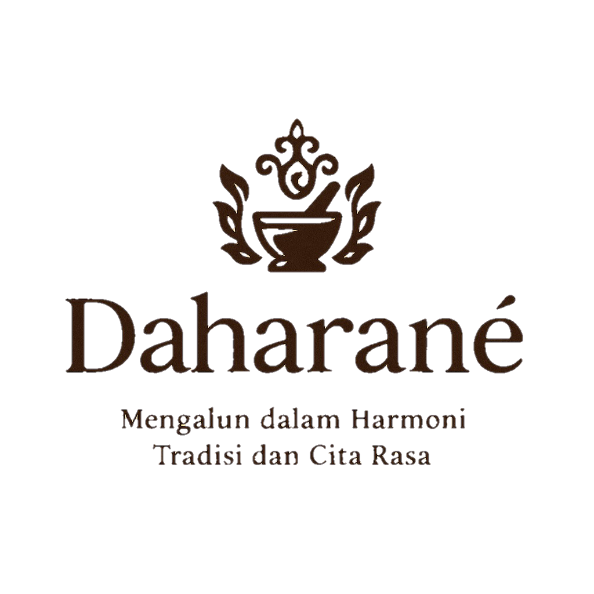

# Daharane – Restoran dengan menggunakan website dalam pemesanan dan pengelolaan pesanannya

  

**Daharane** adalah aplikasi web berbasis Laravel 12 yang memungkinkan pelanggan memesan makanan dari menu restoran menggunakan website ini. Admin dapat mengelola daftar menu, memantau dan memproses pesanan, serta melakukan konfirmasi pembayaran dan penyelesaian.

---

## Fitur Utama

### Untuk Pelanggan
- Scan QR Code sesuai nomor meja (sementara masih menggunakan link website)
- Meliihat daftar menu
- Fitur pencarian menu
- Melihat daftar menu berdasarkan kategori
- Menambahkan item ke keranjang
- Membuat pesanan pada halam keranajang
- Melihat bill pesanan yang sesaui

### Untuk Admin
- Login admin
- Dashboard (modifikasi menu, detail pesanan, log out)
- Modifikasi Menu
- Edit, delete, tambahkan menu
- Menampilkan semua pesanan beserta status pesanannya
- Melakukan konfirmasi pembayaran
- Melakukan penyelesaian pesanan
- Melihat riwayat pesanan

---

## Fitur CRUD yang digunakan
- Modifikasi menu
- Pesanan
- Keranjang (session)

---

## Struktur File Tampilan Customer
- Halaman landing: resources/views/customer/landing.blade.php
- Halaman daftar menu: resources/views/customer/menu.blade.php
- Halaman search: resources/views/customer/search.blade.php
- Halaman kategori menu: resources/views/customer/kategori.blade.php
- Halaman keranjang: resources/views/customer/keranjang.blade.php
- Halaman bill: resources/views/customer/bill.blade.php
- Controller: app/Http/controller/CustomerController.php

---

## Struktur File Tampilan Admin
- Halaman login: resources/views/login.blade.php
- Halaman dashboard: resources/views/dashboard.blade.php
- Halaman modifikasi menu: resources/views/menu/index.blade.php
- Halaman detail menu: resources/views/menu/show.blade.php
- Halaman edit menu: resources/views/menu/edit.blade.php
- Halaman tambah menu: resources/views/menu/create.blade.php
- Halaman detail pesanan: resources/views/detailpesanan.blade.php
- Halaman konfirmasi pembayaran: resources/views/konfirmasi_pembayaran.blade.php
- Halaman konfirmasi pesanan selesai: resources/views/konfirmasi_selesai.blade.php
- Halaman riwayat pesanan: resources/views/riwayat_pesanan.blade.php
- Controller: app/Http/controller/MenuController.php
- Controller: app/Http/controller/AdminAuthController.php
- Middleware: app/Http/Middleware/AdminMiddleware.php

---

## routes
- routes/web.php

---

## Akses Website untuk Customer (masih menggunakan localhost) (masing-masing meja memiliki link yang berbeda)
- http://192.168.210.124:8000/Daharane?meja=1
- http://192.168.210.124:8000/Daharane?meja=2
- http://192.168.210.124:8000/Daharane?meja=3
- http://192.168.210.124:8000/Daharane?meja=4
- http://192.168.210.124:8000/Daharane?meja=5
- http://192.168.210.124:8000/Daharane?meja=6
- http://192.168.210.124:8000/Daharane?meja=7
- http://192.168.210.124:8000/Daharane?meja=8
- http://192.168.210.124:8000/Daharane?meja=9
- http://192.168.210.124:8000/Daharane?meja=10

---

## Akses Website untuk Admin 
- http://192.168.210.124:8000/admin/login
  
## Screenshot Halaman 
- https://drive.google.com/file/d/1A1n16JzIy3vQuKLBnxQtg9D58cCdF4aN/view?usp=sharing 

